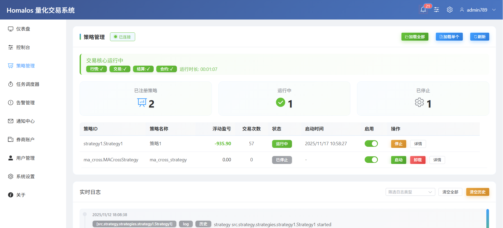

  

&nbsp;

  ✨ A Python-based quantitative trading system applicable to the Chinese futures market ✨
    ✨ 适用于中国期货市场的基于Python的量化交易系统 ✨

<!--

**Here are some ideas to get you started:**

🙋‍♀️ A short introduction - what is your organization all about?
🌈 Contribution guidelines - how can the community get involved?
👩‍💻 Useful resources - where can the community find your docs? Is there anything else the community should know?
🍿 Fun facts - what does your team eat for breakfast?
🧙 Remember, you can do mighty things with the power of [Markdown](https://docs.github.com/github/writing-on-github/getting-started-with-writing-and-formatting-on-github/basic-writing-and-formatting-syntax)
-->
👩‍💻 The project is committed to lowering the entry threshold for quantitative trading of commodity futures in mainland China, helping manual traders to easily cross over to the field of futures quantitative trading, freeing them from the constraints of cumbersome technologies, and devoting themselves to creative conception and optimization of strategies, exploring the infinite possibilities of futures quantitative trading, and enjoying the new experience of technology-enabled trading upgrades.

👩‍💻 该项目致力于降低中国大陆商品期货量化交易的准入门槛，帮助手工交易者轻松跨入期货量化交易领域，摆脱繁琐技术的束缚，专注于策略的创新构思和优化，探索期货量化交易的无限可能，享受技术赋能交易升级带来的全新体验。
